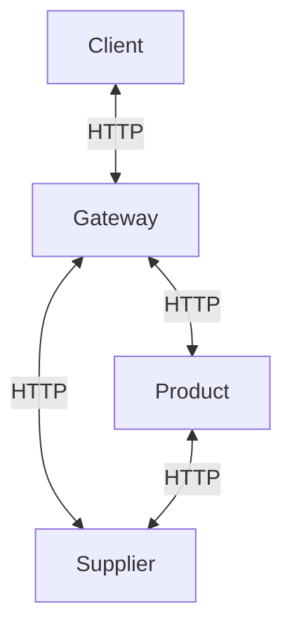

# Communication entre micro-services

## Introduction

La communication entre micro-services peut s'effectuer via des API REST. Chaque
micro-service expose une API qui permet aux autres services de l'interroger ou
de lui envoyer des données. Cela signifie que chaque micro-service envoie des
requêtes HTTP à d'autres micro-services pour obtenir des données ou effectuer
des actions.

## Paquets utilisés dans ce dépôt

En plus des paquets de base, ce dépôt utilise les paquets suivants :

- `Axios` : un client HTTP basé sur les promesses pour le navigateur et
  Node.js. Permet d'effectuer des requêtes HTTP (GET, POST, PUT, DELETE, etc.).
- `http-proxy-middleware` : un middleware pour créer un proxy HTTP. Permet de
  rediriger les requêtes vers d'autres services.

## Architecture utilisée

D'abord, il y a un micro-service `gateway` qui permet de rediriger les requêtes
vers d'autres micro-services. Le service `gateway` est le seul point d'entrée
de l'application. 

Ensuite, il y a deux autres micro-services :

- `supplier` : un service qui gère les fournisseurs.
- `product` : un service qui gère les produits.

Le service `product` communique avec le service `supplier` pour obtenir des
informations sur les fournisseurs. Le diagramme ci-dessous illustre
l'architecture de l'application :



## Exemple de code

Les nouvelles notions à apprendre sont comment utiliser `http-proxy-middleware` pour
créer un proxy HTTP et comment utiliser `Axios` pour
effectuer des requêtes HTTP.

Voici un exemple qui vient du code pour le service `gateway`. Comme vous pouvez
le voir, il suffit de configurer le middleware pour qu'il redirige les requêtes vers le
service `supplier`. Il n'y a pas de magie, derrière `http-proxy-middleware` se cachent
des requêtes HTTP classiques.

```javascript
// ...
const { createProxyMiddleware } = require('http-proxy-middleware');

const app = express();

// ...

// Proxy pour le service utilisateur
// Le service utilisateur écoute sur le port 3001
const supplierProxyMiddleware = createProxyMiddleware({
    target: 'http://localhost:3001',
    changeOrigin: true,
    pathRewrite: { '^/': '/supplier/' }  // Par défaut, Express supprime le préfixe de l'URL dans app.use
  });
app.use('/supplier', logProxyRequest, supplierProxyMiddleware);

// ...

app.listen(3000, () => console.log('🌐 gateway listening on port 3000'));
```

Pour `Axios`, voici un exemple de code qui effectue une requête HTTP GET vers le
service `supplier` pour obtenir la liste des fournisseurs. Ce code se trouve dans le
service `product` :

```javascript
// Route GET /products/:id/supplier — retourne le produit et son fournisseur
// Utilise axios pour faire une requête au service utilisateur
// Le service utilisateur écoute sur le port 3001
app.get('/products/:id/supplier', logRequest, async (req, res) => {
  const product = products.find(p => p.id === parseInt(req.params.id));
  if (!product) return res.status(404).send('Not found');

  try {
    const response = await axios.get(`http://localhost:3001/supplier/${product.supplierId}`);
    res.json({ product, supplier: response.data });
  } catch (err) {
    res.status(500).send('Error contacting supplier service');
  }
});
```

## Comment exécuter le code

Une fois ce dépôt cloné, il faut installer les dépendances pour chaque service.
Vous pouvez le faire avec le script `install-all.js` dans le répertoire
`/scripts` :

```bash
node scripts/install-all.js
```

Ensuite, il faut démarrer chaque service. Vous pouvez le faire avec le script
`start-all.js` dans le répertoire `/scripts` :

```bash
node scripts/start-all.js
```

Vous pouvez tester le service `gateway` en accédant à
[http://localhost:3000](http://localhost:3000) dans votre navigateur. Cela chargera
une page HTML bien basique qui vous permettra de tester les services `product` et
`supplier`.

Il existe aussi un fichier `request.http` pour tester les services
directement.

Notez qu'au besoin, le script `stop-all.js` peut être utilisé pour arrêter
tous les services. Toutefois, lorsque vous utilisez le script `start-all.js`,
le simple fait de quitter le terminal *devrait* arrêter tous les services.